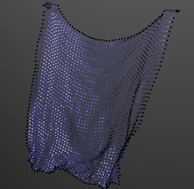

WebGL Cloth Simulation
--------------------------------------------

by: [Ziwei Zong](https://www.ziweizong.com)

* LinkedIn: [Ziwei Zong](https://www.linkedin.com/in/ziweizong)
* Twitter:  [@zzammie_zz](https://twitter.com/zammie_zz)

0. Overview
--------------------------------------------

Cloth Simulation using transform feedback for WebGL 2.0 supported browsers and ping-ponging texture method for browsers only supporting WebGL 1.0.

**Using [Brandon Jones](https://github.com/toji)'s [WebGL 2 Particle Simulation](https://github.com/toji/webgl2-particles) as framework.**

* Live Demo: View online at [TODO:***]()
* Video Demo: [TODO: youtube]()

WebGL 2.0 version tested successfully on Chrome(Windows), Chrome Canary (Windows).

WebGL 1.0 version tested successfully on Chrome(Windows), Chrome Canary (Windows), FireFox (Windows)

TODO: Use another pic

1. Instructions
--------------------------------------------

### 1.1 How to use

#### 1.1.1 Enable WebGL 2.0

#### 1.1.2 Features

* **WebGL 1.0 & WebGL 2.0**

	If the project is running on browser that supports only WebGL 1.0, there would be a "WebGL Cloth Simulaiton" object in the scene.
Otherwise, if the browser supports WebGL 2.0, there would be "WebGL 2 Cloth Simulation" instead and the simulation is using transform feedback.

	|WebGL 1.0 ScreenShot		|WebGL 2.0 ScreenShot
	|:-------------------------:|:-------------------:
	|		|

* **Settings and Basic Animation Control**

	|

	* **Render Mode**

		|Points						|Triangle
		|:-------------------------:|:-------------------:
		||
		|		|

* **Interactions**

	* **RigidBody**

	  

	  Cloth-Rigidbody collision is more stable in WebGL2 implementation than in WebGL1.

	  |WebGL 1.0 Rigidbody		|WebGL 2.0 Rigidbody 
	  |:-------------------------:|:-------------------:
	  |		|

	* **Wind**

	  TODO: add pic here

	* **Pins**

	  There are two kinds of pins: pin points and pin edges. Select them under Interaction_Folder->Edges or ->Pins
	  

	  WebGL 2 version is supporting movable pin.

	  TODO: movable pin gif.

### 1.2 Implementation

#### Transform Feedback

#### Ping-ponging Texture

#### Unsolved (UBO)

2. Performance Analysis
--------------------------------------------

### 2.1 Cloth Dimension (Particle Number)

### 2.2 Code Quality

3.References
--------------------------------------------