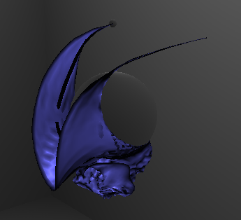
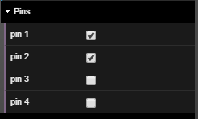

WebGL Cloth Simulation
--------------------------------------------

by: [Ziwei Zong](https://www.ziweizong.com)

* LinkedIn: [Ziwei Zong](https://www.linkedin.com/in/ziweizong)
* Twitter:  [@zzammie_zz](https://twitter.com/zammie_zz)

Overview
--------------------------------------------

Cloth Simulation using transform feedback for WebGL 2.0 supported browsers and ping-ponging texture method for browsers only supporting WebGL 1.0.

**Using [Brandon Jones](https://github.com/toji)'s [WebGL 2 Particle Simulation](https://github.com/toji/webgl2-particles) as framework.**

* Live Demo: View online at [TODO:***]()
* Video Demo: [TODO: youtube]()

WebGL 2.0 version tested successfully on Chrome(Windows), Chrome Canary (Windows).

WebGL 1.0 version tested successfully on Chrome(Windows), Chrome Canary (Windows), FireFox (Windows)

Instructions
--------------------------------------------

#### How to use

##### Enable WebGL 2.0

##### Features

* WebGL 1.0 & WebGL 2.0

If the project is running on browser that supports only WebGL 1.0, there would be a "WebGL Cloth Simulaiton" object in the scene.
Otherwise, if the browser supports WebGL 2.0, there would be "WebGL 2 Cloth Simulation" instead and the simulation is using transform feedback.

|WebGL 1.0 ScreenShot		|WebGL 2.0 ScreenShot
|:-------------------------:|:-------------------:
|		|

* Settings and Basic Animation Control

|

* Interactions

** RigidBody

Cloth-Rigidbody collision is more stable in WebGL2 implementation than in WebGL1.

|WebGL 1.0 Rigidbody		|WebGL 2.0 Rigidbody 
|:-------------------------:|:-------------------:
|		|

** Wind

TODO: add pic here

** Pins

TODO: movable pin gif.

#### Implementation

##### Transform Feedback

##### Ping-ponging Texture

##### Unsolved (UBO)

Performance Analysis
--------------------------------------------

#### Cloth Dimension (Particle Number)

#### Code Quality

References
--------------------------------------------